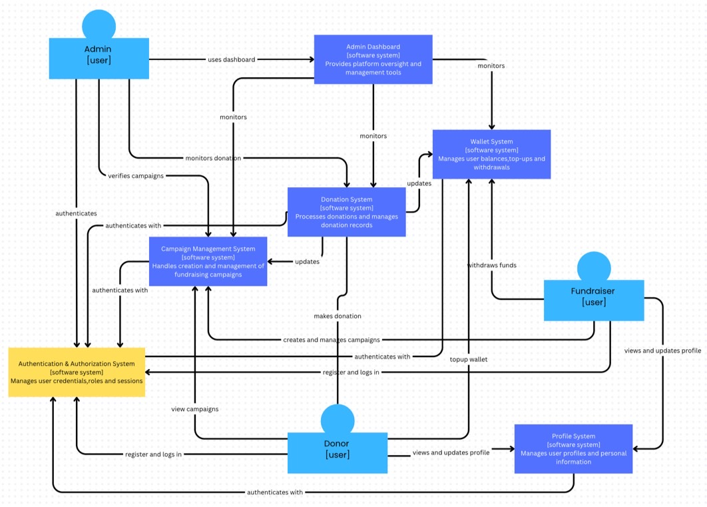
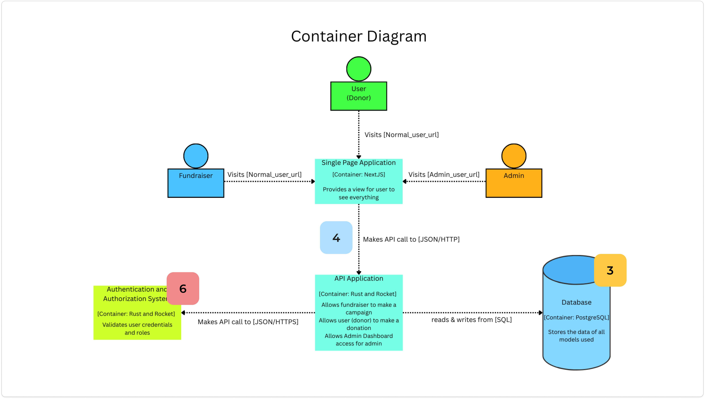
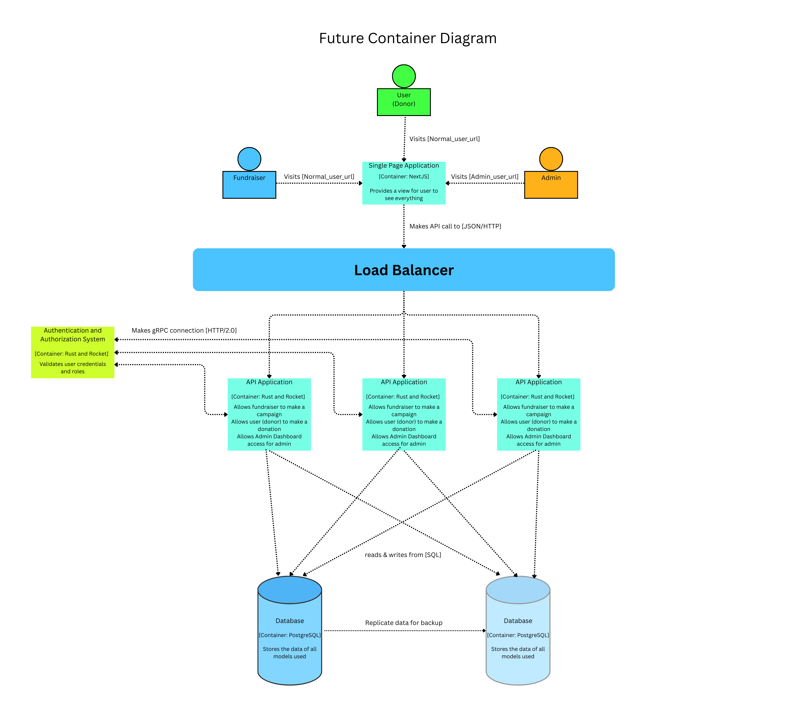

# Software Architecture

## Context Diagram

## Container Diagram

## Deployment Diagram

## Risk Storming
Risk Storming berikut merupakan hasil diskusi dari Valentino Kim Fernando dan Daniel Liman.

### Identification

Risk Matrix

### Consenssus

- Container Diagram

    

- Deployment Diagram

    

Pada proses mengidentifikasi risk, kedua partisipan sama-sama setuju jika:
- Masalah latensi autentikasi merupakan risiko yang akan sering terjadi, namun memiliki resiko keseluruhan sedang (6)
- Request load yang berlebihan merupakan risiko yang akan lumayan sering terjadi, namun memiliki resiko keseluruhan sedang (4)
- Konsistensi data pada database merupakan merupakan risiko yang jarang terjadi, namun memiliki resiko keseluruhan yang tinggi (3)

### Mitigations

**Future Architecture**

Arsitektur diperbaharui untuk mengimplementasikan:
- gRPC untuk komunikasi antara backend utama dan auth provider
- Database duplicate yang berperan untuk database cadangan dan arsip
- Load balancer yang terhubung ke beberapa instance backend untuk mengurangi load request yang menumpuk

Kekurangan dari implementasi di atas adalah perlunya cost lebih untuk me-maintain database baru dan beberapa instance tambahan yang akan dijalankan pada cloud server. Walaupun begitu, kelompok kami akan tetap melakukan diskusi lanjut seterusnya agar bisa meminimalkan efek dari kekurangan ini.

## Individual Diagram

| [Daniel Liman](Daniel.md) | [Ivan Jehuda Angi](Ivan.md) | [Utandra Nur Ahmad Jais](Utandra.md) | [Valentino Kim Fernando](Valen.md) | [Valentino Vieri Zhuo](Tino.md) |
| -- | -- | -- | -- | -- |